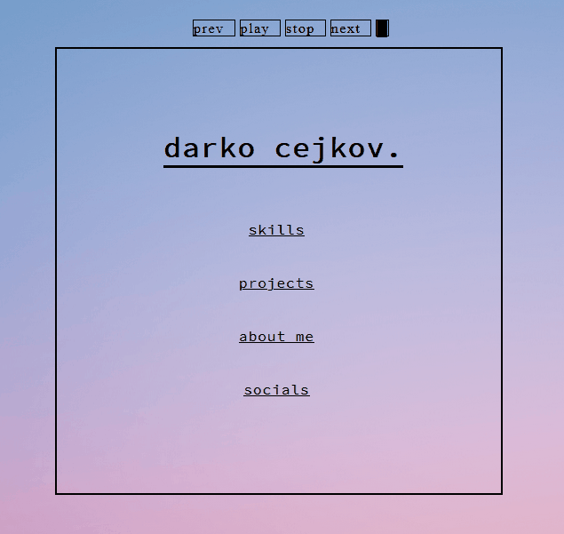

# (legacy portfolio)
personal website/blog

A personal portfolio.
Built from scratch using HTML/CSS/JS.

The library used to make the sketch is P5.js, and I integrated it directly into my own JS to be able to turn it on/off using buttons.

here's a demo of what the site looks/performs like.

the [prev], and [next] buttons are meant to change sketches, but I only have 1 so far.
the site isn't optimized for mobile/tablets/etc, mostly only for desktop. it has some weird properties if you resize it, it's fun.
